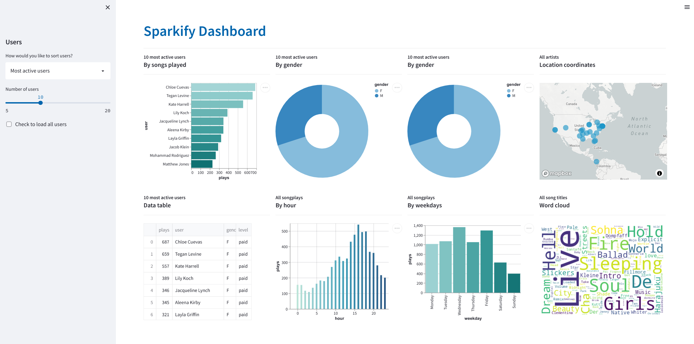

# Sparkify Dashboard & Analytics
 

>Author: Rodrigo de Alvarenga Mattos
>
>June 5, 2022

 

The [Streamlit](https://streamlit.io) application framework was used to build an interactive analytics dashboard. The following table describes the main application features and resources:

| Feature or Resource   | URL                                                                                               |
|-----------------------|---------------------------------------------------------------------------------------------------|
| Dashboard Application | [www.datadiver.dev](https://datadiver.dev)                                                        |
| Github source code    | [Github repository](https://github.com/rodrigoalvamat/datadiver)                                  |
| SQL Analytics         | [queries.py](https://github.com/rodrigoalvamat/datadiver/blob/main/sparkify/dashboard/queries.py) |
| Cloud PaaS            | [Heroku](https://heroku.com)                                                                      |
| Cloud PostgresSQL     | [ElephantSQL](https://www.elephantsql.com/)                                                       |
 
 

## Dashboard Screenshot

 
 

There were some limitations to developing a more interactive dashboard, with a greater variety of information, because of the missing data in the JSON files and some restrictions defined by the project requirements. However, several improvements are on the roadmap to overcome this issues:

## Next Release Roadmap
- Download a larger sample of the [Million Song Dataset](http://millionsongdataset.com) and use the [event simulator](https://github.com/Interana/eventsim) to improve the dataset quality.
- Use the [Google Maps API Python Client](https://github.com/googlemaps/google-maps-services-python) geocode method to get the latitude and longitude for the songplays' locations. 
- Create interactive graph and vizualization components for all dimensions (songs, artists, users, time) of the fact table (songplays).
- Docstring documentation of the dashboard source code.
